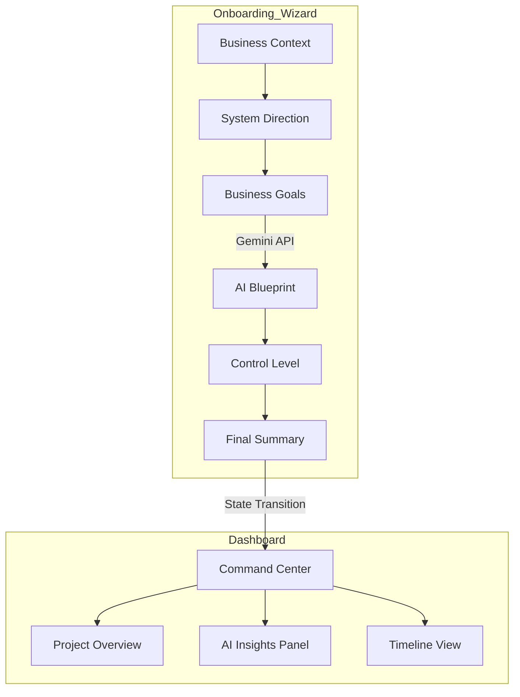

# Sun AI Agency | System Overview

## 1. Executive Summary
Sun AI Agency is a premium platform designed to bridge the gap between abstract business goals and concrete AI implementations. The system utilizes a guided, multi-step onboarding "Wizard" to generate a tailored technical blueprint, which is then managed through a sophisticated "Command Center" dashboard.

---

## 2. Technical Stack
The application is built using a modern, lightweight, and performant frontend stack.

| Category | Technology | Version |
| :--- | :--- | :--- |
| **Framework** | React | 19.2.3 |
| **Build Tool** | Vite | Latest (ESM Module) |
| **Language** | TypeScript | Latest |
| **Styling** | Tailwind CSS | 3.x (JIT via CDN) |
| **Icons** | Lucide React | 0.562.0 |
| **AI Engine** | Google Gemini API | gemini-3-flash-preview |
| **Deployment** | Vercel / Static | - |

---

## 3. Directory Structure
```text
.
├── components/
│   ├── Layout.tsx          # 3-panel architecture (Left, Main, Right)
│   └── Wizard/
│       └── WizardSteps.tsx # Functional components for steps 1-6
├── docs/
│   └── 01-overview.md     # System documentation (this file)
├── services/
│   └── gemini.ts           # AI Logic (Recommendations & Insights)
├── App.tsx                 # Main application & routing controller
├── constants.tsx           # Static config (Industries, Goals, Systems)
├── index.html              # Entry HTML & ESM Import Map
├── index.tsx               # React root mounting logic
├── metadata.json           # Application metadata
└── types.ts                # Global TypeScript definitions
```

---

## 4. Application Architecture

### Core Workflow Diagram


---

## 5. Sitemap & Navigation
The current application uses **Conditional State Routing** to manage the transition between the Wizard and the Dashboard.

| Path / View | Logic Trigger | Description |
| :--- | :--- | :--- |
| `/` (Wizard) | `isComplete: false` | Multi-step lead capture and AI reasoning. |
| `/dashboard` | `isComplete: true` | Strategic management and system tracking. |

### Routing Hierarchy
- **App Root**
  - **Wizard View** (Internal steps: 1-6)
    - `Step 1`: Context (Identity)
    - `Step 2`: Direction (Category)
    - `Step 3`: Goals (Outcomes)
    - `Step 4`: Recommendations (AI Reasoning)
    - `Step 5`: Control (Autonomy)
    - `Step 6`: Summary (Confirmation)
  - **Dashboard View**
    - `Nav`: Command Center, Timeline, Systems, Security
    - `Main`: Project Stats, Active Modules, Timeline
    - `Right`: AI Strategy & Insights

---

## 6. Features & Progress

### ✅ Completed
- **3-Panel Architecture**: Premium UI layout with context panels and AI sidebars.
- **Dynamic Wizard**: Full 6-step flow with validation and data persistence.
- **AI Blueprinting**: Integration with Gemini 3 to generate custom service recommendations based on business inputs.
- **State Persistence**: Complex `ProjectState` object managed via React hooks.
- **Command Center**: Post-onboarding experience with specific timeline and system views.
- **AI Strategy Service**: Automated generation of "Strategic Insights" for the dashboard.

### 🚀 Planned (Phase 2+)
- **React Router Integration**: Transition from state-based to path-based routing (`createHashRouter`).
- **Persistence Layer**: Supabase/Postgres integration for saving client blueprints.
- **Active System Controls**: Functional toggles to "activate" or "pause" AI agents.
- **User Authentication**: Secure client login and project management.

---

## 7. Import & Build Rules
- **No Import Maps**: Standard ESM resolution via Vite.
- **Strict Typing**: All business entities (Systems, Goals, Projects) are defined in `types.ts`.
- **Atomic Components**: Wizard steps are decoupled for easier testing and logic updates.
- **Gemini Service**: Centralized in `services/gemini.ts` with structured JSON output configurations.
