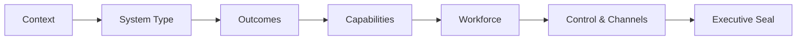
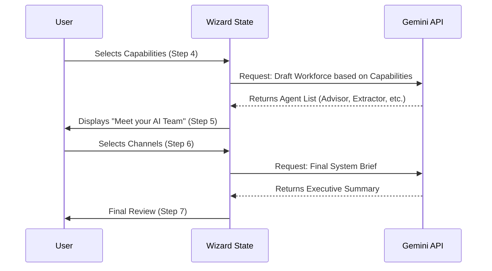

# Sun AI | Service Integration Strategy

## 1. Executive Assessment (Current State)
The existing application establishes a premium 3-panel architecture and a functional 6-step wizard. However, the current flow treats "Services" as a black-box generation from Gemini. We need to transition to a **Configurable Intelligence** model where users explicitly select their desired capabilities and digital workforce.

### Current Completion Status
- [x] **Step 1: Business Context** (Identity & Signal Intake)
- [x] **Step 2: System Direction** (Archetype Selection)
- [x] **Step 3: Strategic Outcomes** (Business Goals)
- [x] **Step 4: Recommendations** (Gemini-driven output)
- [x] **Step 5: Autonomy** (Control Level)
- [x] **Step 6: Summary** (Project Handover)

---

## 2. Refined Wizard Architecture (7-Step Flow)

To incorporate the full Sun AI offering, we will expand the wizard to 7 steps, introducing dedicated screens for **Capabilities** and **Digital Workforce**.

### Progress Tracker Design
A sleek, horizontal progress bar at the top of the `Main` panel (Work Area) featuring:
- Thin hairline design.
- Animated "Sun" icon moving between nodes.
- Percentage and Step Title.

---

## 3. Step-by-Step Task implementation

### Step 1: Business Context (Baseline)
*Status: Completed*
- Capture identity and description.
- Trigger `Analyst` agent for market signals.

### Step 2: System Architecture (The "What")
*Status: Completed (Updating to include explicit Core Systems)*
- **Refinement**: Update `SYSTEM_TYPES` constants to align with "Core AI Systems" (AI Dashboard, Chat Assistants, Automation, AI CRM, Internal Ops, Knowledge Base).

### Step 3: Business Results (The "Why")
*Status: Completed*
- Multi-select ROI outcomes.
- Predicted impact stats in right sidebar.

### Step 4: Capability Blueprint (NEW - The "How")
- **Prompt**: "What specific capabilities should we activate?"
- **Selection Grid**:
    - **Core**: Lead Management, Automated Follow-Ups, BI Reporting, Workflow Automation.
    - **Advanced**: Predictive Analytics, AI Lead Scoring, Personalization, Sentiment Analysis.
- **Logic**: Gemini analyzes selection to suggest specific technical requirements.

### Step 5: Digital Workforce (NEW - The "Who")
- **Prompt**: "Provisioning your Digital Team."
- **Visual**: Cards for specific agents (Advisor, Planner, Analyst, etc.).
- **Behavior**: Agents are automatically "Drafted" based on Step 4 selections, but the user can toggle/customize them.

### Step 6: Control & Communication (The "Interaction")
- **Prompt**: "Defining Autonomy & Channels."
- **Selection A**: Autonomy Level (Assisted, Proactive, Advanced).
- **Selection B**: Channels (Email, WhatsApp, Dashboard Alerts, Internal Notifications).

### Step 7: Executive Seal (The "Agreement")
- **Summary**: Full breakdown of System + Capabilities + Agents + Channels.
- **Action**: "Initialize Command Center".

---

## 4. Mermaid Flow - Data & State

---

## 5. Tasks for Implementation Phase

### Task 4.1: Progress Tracker Component
- [ ] Build `<WizardProgressTracker />` with 7 steps.
- [ ] Add it to `ThreePanelLayout` or top of `Main` area.

### Task 4.2: Capabilities Selection Screen
- [ ] Create `StepCapabilities` component.
- [ ] Define `CAPABILITIES` constant in `constants.tsx`.
- [ ] Implement multi-select with "Core" vs "Advanced" categorization.

### Task 4.3: Digital Workforce Screen
- [ ] Create `StepWorkforce` component.
- [ ] Define `AI_AGENTS` constant with roles and descriptions.
- [ ] Implement animated "Selection" sequence (Drafting the team).

### Task 4.4: Channels & Control Integration
- [ ] Merge Control Level and Communication Channels into a single "Interaction" step.
- [ ] Add `channels` array to `ProjectState`.

### Task 4.5: Gemini Prompt Updates
- [ ] Update `generateRecommendations` in `solutions.ts` to consume the selected `capabilities`.
- [ ] Update `getAIInsights` to reference the specific `agents` and `channels`.

---

## 6. Success Metrics
- User selects outcomes and *sees* the specific agents being "hired" to achieve them.
- Final dashboard populated with specific agents and channels defined in the wizard.
- Executive-grade feel maintained via consistent typography and spacing.
