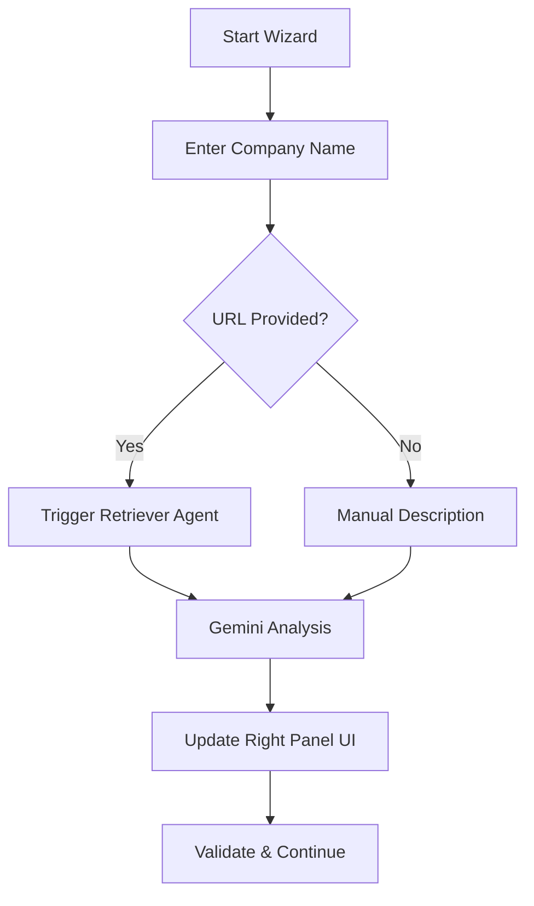
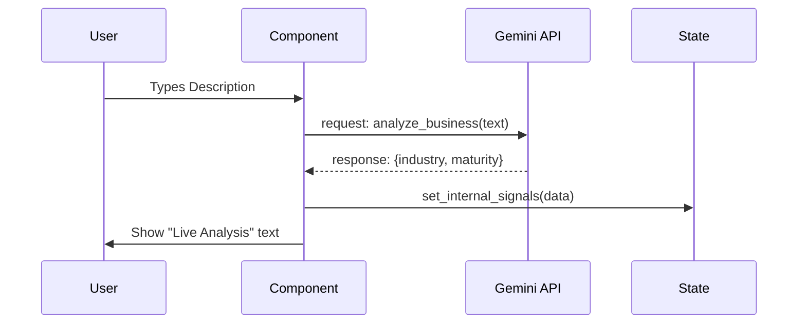

# Task 01: Business Context & Signal Intake

## Short Goal Summary
- Capture core business identity and description.
- Trigger asynchronous market/competitor analysis.
- Establish the baseline for AI service recommendations.

## Screen Purpose
Identify the user and their business model immediately to personalize the entire remaining journey.

## Route + Component + State Keys
- **Route**: `/` (Internal State: `step: 1`)
- **Component**: `StepBusinessContext`
- **State Keys**: `companyName`, `website`, `description`, `industrySignals` (internal)

## Inputs → Outputs
| Input | Type | Validation | Output (State) |
| :--- | :--- | :--- | :--- |
| Company Name | String | Required, Min 2 chars | `companyName` |
| Website URL | String (URL) | Optional, Valid URL pattern | `website` |
| Description | Textarea | Required, Min 20 chars | `description` |

## UI Layout Spec (3-Panel)
- **Left (Context)**: Step 1 of 6 indicator. Label: "Business Basics". Bullet list of what we learn here.
- **Center (Work)**: Clean vertical form. Large, inviting input fields. Primary CTA: "Continue to System Direction".
- **Right (Intelligence)**: "Live Analysis" panel. Animated pulse indicator. Text: "Synthesizing market positioning..."

## Core Features
- Real-time form validation.
- Responsive layout (mobile-first center panel).
- Secure data handling notice.

## Advanced / AI Features
- **Auto-Discovery**: If URL is entered, trigger a background fetch/scrape (mocked or via API).
- **Sentiment Mapping**: Analyzing description tone to predict "Industry Fit".

## AI Agents Used
| Agent | Role | When |
| :--- | :--- | :--- |
| **Analyst** | Understands business & market | On Blur of Description |
| **Retriever** | Pulls public signals | On URL input change |
| **Scorer** | Generates internal readiness | Post-step completion |

## Gemini 3 Tools Used
| Tool | Why | What it returns |
| :--- | :--- | :--- |
| **URL Context** | Extract positioning | Industry, services, tech stack signals |
| **Search Grounding** | Competitive context | Top 3 benchmarks in niche |
| **Thinking** | Business Maturity | Logic regarding potential automation gaps |

## Workflow Logic
1. **If** Website URL is provided: **Then** trigger `Analyst` agent to verify industry.
2. **If** Description is < 50 chars: **Then** show a nudge to "Add more detail for better AI accuracy".

## Automations & Triggers
- **Event**: `onBlur` of description field.
- **Action**: Call `generateSignals` API (Gemini).
- **Guardrail**: Prevent submission if "AI Readiness" signal fails (e.g., gibberish input).

## Sample Data
```json
{
  "companyName": "Solaris Tech",
  "website": "https://solaris.io",
  "description": "We provide sustainable energy solutions for enterprise data centers using smart grid tech."
}
```

## Mermaid Diagrams

### Flowchart


### Sequence Diagram


## Tasks & Steps
1. [ ] Build `StepBusinessContext` UI component.
2. [ ] Implement form validation (Zod or simple state).
3. [ ] Create `Analyst` service wrapper for Gemini.
4. [ ] Connect "Live Analysis" animated state to right panel.
5. [ ] Ensure "Continue" button is disabled until valid.

## Success Criteria
- User can enter data and progress to Step 2.
- Right panel updates visually when text is entered.
- Errors are shown for invalid URLs.

## Production-Ready Checklist
- Performance: Input debounce for AI triggers.
- UX: Clear "Private & Secure" messaging.
- Edge Case: Handle "No Internet" for Gemini calls gracefully.

## Final Validation Steps
- Test with 10 words vs 200 words description.
- Test with valid vs invalid URL.
