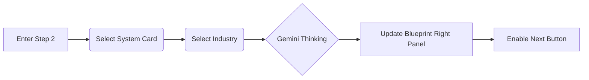
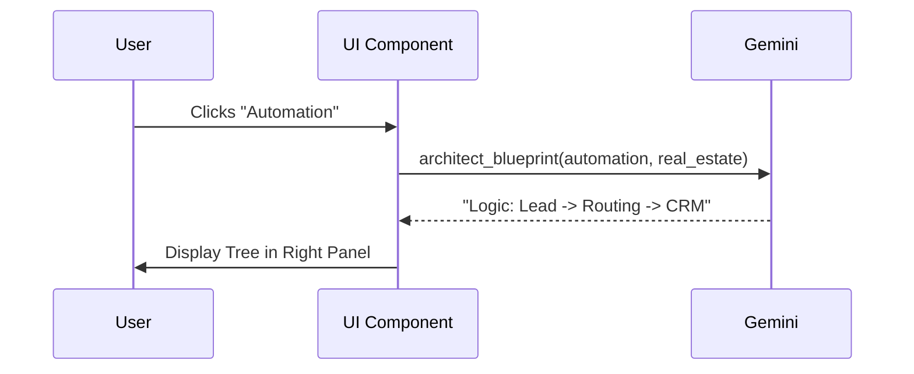

# Task 02: System Direction (What & Who)

## Short Goal Summary
- Categorize the intended system (Internal vs External).
- Select industry context for tailored reasoning.
- Visualize the high-level system blueprint.

## Screen Purpose
Define the technical "flavor" of the build so Gemini can suggest relevant architecture.

## Route + Component + State Keys
- **Route**: `/` (Internal State: `step: 2`)
- **Component**: `StepSystemDirection`
- **State Keys**: `systemType`, `industry`, `systemBlueprint` (AI generated)

## Inputs → Outputs
| Input | Type | Validation | Output (State) |
| :--- | :--- | :--- | :--- |
| System Type | Card Selection | Required (Single Select) | `systemType` |
| Industry | Dropdown/Grid | Required | `industry` |

## UI Layout Spec (3-Panel)
- **Left (Context)**: Summary of Step 1. Label: "System Intent". Progress: 33%.
- **Center (Work)**: Grid of 5-6 cards (Dashboard, Chatbot, Automation, etc.). Each card has an icon and 1-sentence value prop.
- **Right (Intelligence)**: "System Blueprint" (Read-only). A text-based tree diagram that updates based on selection.

## Core Features
- Card-based selection with hover effects.
- Industry searchable dropdown.
- Back button to Step 1.

## Advanced / AI Features
- **Dynamic Blueprinting**: Gemini generates a "Technical Strategy" string in the right panel based on the industry + system type combination.

## AI Agents Used
| Agent | Role | When |
| :--- | :--- | :--- |
| **Planner** | Maps intent to structure | On Selection Change |
| **Orchestrator** | Sequences the logic | Transition to Step 3 |

## Gemini 3 Tools Used
| Tool | Why | What it returns |
| :--- | :--- | :--- |
| **Thinking** | Logic of selection | Why "Chatbot" is better for "Real Estate" |
| **Structured Outputs** | Formatting the blueprint | A clean JSON object for the UI tree |

## Workflow Logic
1. **If** Industry is "Healthcare": **Then** add "HIPAA Compliance Node" to the Blueprint preview.
2. **If** System Type is "Automation": **Then** prioritize "Efficiency" labels in Blueprint.

## Automations & Triggers
- **Event**: Selection of Card.
- **Action**: Update `systemBlueprint` state.
- **Guardrail**: Only one system type allowed per blueprint (in V1).

## Sample Data
```json
{
  "systemType": "automation",
  "industry": "Real Estate",
  "blueprint": "Agentic Lead Routing + Automated Document Indexing"
}
```

## Mermaid Diagrams

### Flowchart


### Sequence Diagram


## Tasks & Steps
1. [ ] Create SVG icon set for System Types.
2. [ ] Build selection cards with "Selected" state styling.
3. [ ] Implement `StepSystemDirection` logic.
4. [ ] Create mock blueprint data (or connect Gemini).

## Success Criteria
- Selection is visually distinct.
- Blueprint panel updates within 500ms of selection.

## Production-Ready Checklist
- Accessibility: Keyboard navigation for cards (ARIA roles).
- UX: Tooltip for "Advanced" labels.
