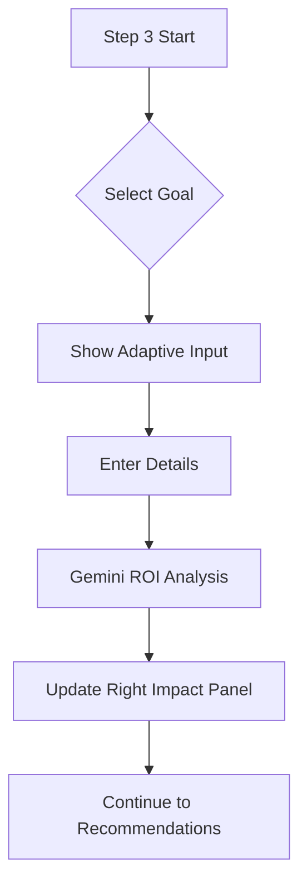

# Task 03: Business Goals (Outcomes)

## Short Goal Summary
- Shift focus from "Features" to "Business Outcomes".
- Capture quantitative vs qualitative goals.
- Predict business impact using AI.

## Screen Purpose
Align the client's investment with measurable business results (ROI).

## Route + Component + State Keys
- **Route**: `/` (Internal State: `step: 3`)
- **Component**: `StepBusinessGoals`
- **State Keys**: `goals` (Array), `impactPreview` (String)

## Inputs → Outputs
| Input | Type | Validation | Output (State) |
| :--- | :--- | :--- | :--- |
| Outcome Chips | Multi-Select | Min 1 Required | `goals` |
| Follow-up Questions | Text (Conditional) | Optional | `goalDetails` |

## UI Layout Spec (3-Panel)
- **Left (Context)**: "Defining Value". Why goals matter.
- **Center (Work)**: Interactive chips/cards (Revenue, Time, Experience, Scale). Selecting a chip reveals a "Context-specific follow-up" question.
- **Right (Intelligence)**: "Impact Preview". A bar chart or bulleted list of "Estimated ROI" (Qualitative).

## Core Features
- Multi-select with toggle logic.
- Adaptive questioning (revealing fields only when needed).

## Advanced / AI Features
- **Outcome Logic**: Gemini analyzes the combination of Industry + Goals to suggest a specific "Success KPI".

## AI Agents Used
| Agent | Role | When |
| :--- | :--- | :--- |
| **Planner** | Defines success metrics | Selection Change |
| **Analyst** | Predicts friction points | Selection Change |

## Gemini 3 Tools Used
| Tool | Why | What it returns |
| :--- | :--- | :--- |
| **Thinking** | Business Strategy | Correlating "Scale" with "Internal Tooling" |
| **Structured Outputs** | Impact Data | Object containing {roi_statement, risk_level} |

## Workflow Logic
1. **If** "Revenue" is selected: **Then** ask "What is your target conversion lift?".
2. **If** > 3 goals selected: **Then** show "Focus Nudge": "Concentrating on 1-2 goals yields better AI performance."

## Automations & Triggers
- **Trigger**: `onSelect` of 3rd chip.
- **Action**: Highlight primary vs secondary goals.

## Sample Data
```json
{
  "goals": ["revenue", "time"],
  "goalDetails": "We want to reduce manual quote generation by 80%."
}
```

## Mermaid Diagrams

### Flowchart


## Tasks & Steps
1. [ ] Build goal chip components.
2. [ ] Implement conditional "Follow-up" input logic.
3. [ ] Design the "Impact Preview" panel visualization.
4. [ ] Connect Gemini to process goals array.

## Success Criteria
- Adaptive inputs work smoothly without layout jumps.
- User can select and unselect goals.
