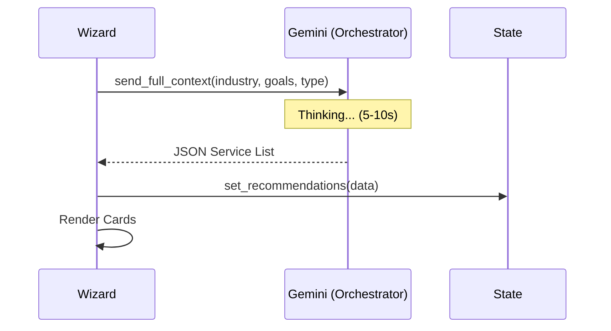

# Task 04: Recommended Services (The Blueprint)

## Short Goal Summary
- Present the custom AI services bundle.
- Differentiate between Core and Advanced features.
- Explain "Why" each service was chosen.

## Screen Purpose
Transition from "Planning" to "Buying/Building". This is the value realization moment.

## Route + Component + State Keys
- **Route**: `/` (Internal State: `step: 4`)
- **Component**: `StepRecommendedServices`
- **State Keys**: `recommendations` (Array of Objects)

## Inputs → Outputs
| Input | Type | Validation | Output (State) |
| :--- | :--- | :--- | :--- |
| Review Recommendations | Read-only / Approval | User must acknowledge | `approvedRecommendations` |

## UI Layout Spec (3-Panel)
- **Left (Context)**: "Your AI Blueprint". List of inputs used.
- **Center (Work)**: List of 3-4 service cards. Each card has: Name, Value Statement, Tier Badge (Core/Advanced), and "Why it matters".
- **Right (Intelligence)**: "System Flow" diagram. A visual map of how Service A feeds into Service B.

## Core Features
- Tier tagging (Core vs Advanced).
- Animated loading state ("Architecting your system...").
- Service detail expansion.

## Advanced / AI Features
- **Deduplication**: Gemini ensures suggested services don't overlap in functionality.
- **Tiering Logic**: High-risk/High-reward features are automatically marked as "Advanced".

## AI Agents Used
| Agent | Role | When |
| :--- | :--- | :--- |
| **Orchestrator** | Assembles the final bundle | On Step Load |
| **Optimizer** | Ensures minimal overlap | On Generation |

## Gemini 3 Tools Used
| Tool | Why | What it returns |
| :--- | :--- | :--- |
| **Thinking** | Solution Design | Mapping goals to specific agent roles |
| **Structured Outputs** | JSON Bundle | Array: [{title, desc, impact, tier}] |

## Workflow Logic (The Recommendation Engine)
- **Logic**: Use the `ProjectState` (Industry, Goals, Type) to query Gemini.
- **Guardrail**: If Gemini fails, load "Default Industry Templates" based on Step 2.

## Automations & Triggers
- **Trigger**: Transition from Step 3 -> 4.
- **Action**: API Call to `/generate-blueprint`. Show skeleton loaders for 2 seconds.

## Mermaid Diagrams

### Sequence Diagram

## Tasks & Steps
1. [ ] Implement the `generateRecommendations` service (Gemini).
2. [ ] Build the "Architecting..." loading screen.
3. [ ] Design "Service Card" component with Tier badges.
4. [ ] Implement the "Why it matters" toggle/expand logic.

## Success Criteria
- 3-4 unique, non-overlapping services are shown.
- Every service has a clear "Value Statement".
