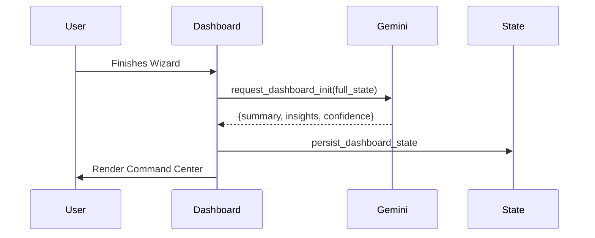

# Task 07: Command Center (Day 1)

## Short Goal Summary
- Provide immediate confirmation of setup.
- Outline the Day 1 - Day 30 roadmap.
- Present live AI insights based on the wizard data.

## Screen Purpose
The landing page of the platform. Designed to build excitement and operational clarity immediately after the wizard closes.

## Route + Component + State Keys
- **Route**: `/dashboard`
- **Component**: `DashboardHome`
- **State Keys**: `executiveSummary`, `nextSteps`, `activeSystems`

## Inputs → Outputs
| Input | Source | Output (UI) |
| :--- | :--- | :--- |
| Wizard Data | Global State | "Welcome Back [Company]" |
| Blueprint | Global State | System Cards |

## UI Layout Spec (3-Panel)
- **Left (Context)**: Persistent navigation. Project status indicator ("Setup").
- **Center (Work)**: Large "Executive Summary" text block. Grid of "System Overview" cards. Timeline mini-widget.
- **Right (Intelligence)**: "Live Strategic Insights". Proactive suggestions from the Analyst agent.

## Core Features
- Executive Summary (AI generated).
- System Status tracking.
- Interactive Timeline preview.

## Advanced / AI Features
- **Confidence Scoring**: Gemini calculates the probability of Day 30 success based on current data.
- **Risk Nudges**: Warning if "Advanced" control was chosen with "Low Data" provided.

## AI Agents Used
| Agent | Role | When |
| :--- | :--- | :--- |
| **Orchestrator** | Loads the system state | Page Mount |
| **Analyst** | Summarizes intent | Page Mount |

## Gemini 3 Tools Used
| Tool | Why | What it returns |
| :--- | :--- | :--- |
| **Thinking** | Strategic overview | The "Executive Summary" text |
| **Search Grounding** | Market Context | Relevant news for the industry right now |

## Workflow Logic
1. **If** First Visit: **Then** play "Initialization Sequence" (confetti or subtle animation).
2. **If** Profile incomplete: **Then** show "Data Opportunity" in Right Panel.

## Sample Data
```json
{
  "executiveSummary": "Sun AI is initializing a Proactive Intelligence Layer for Solaris Tech to optimize data center energy routing...",
  "nextSteps": ["Verify security credentials", "Approve Phase 1 Blueprint"]
}
```

## Mermaid Diagrams

### Sequence Diagram


## Tasks & Steps
1. [ ] Implement the `ThreePanelLayout` dashboard version.
2. [ ] Create the `Executive Summary` block with typography focus.
3. [ ] Connect "Active Systems" cards to the recommendations array.
4. [ ] Build the "Intelligence Sidebar" with a rotating carousel of insights.

## Success Criteria
- Dashboard loads within 3 seconds of wizard completion.
- Summary text is high-quality, professional, and specific.
