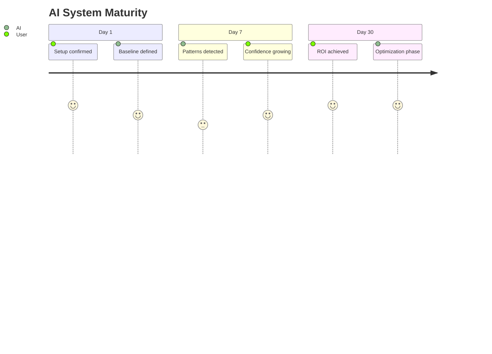

# Task 12: ROI & Maturity Progression (Day 7 / 30)

## Short Goal Summary
- Visualize the system's "Learning Curve".
- Compare "Plan vs Reality".
- Identify optimization opportunities.

## Screen Purpose
Retain clients by proving growth and maturity. Transition from "Setup" to "Optimization".

## Route + Component + State Keys
- **Route**: `/dashboard` (Overlay or Tab)
- **Component**: `ProgressionView`
- **State Keys**: `maturityScore`, `deltaInsights`

## UI Layout Spec (3-Panel)
- **Main**: 3-stage switch (Day 1 / Day 7 / Day 30). Each stage shows a different "System State" visualization.
- **Right**: "Optimization Engine". Specific upgrade suggestions.

## AI Agents Used
| Agent | Role | When |
| :--- | :--- | :--- |
| **Analyst** | Compares current vs target | On Load |
| **Scorer** | Recalculates business value | Daily |

## Gemini System Prompt (Progression)
```
SYSTEM:
Compare current system state to Day 1.
Identify 2 specific efficiency gains and 1 upgrade path.
Tone: Growth-oriented, strategic.
```

## Mermaid Diagrams

### Journey Diagram


## Tasks & Steps
1. [ ] Build the "Progression Stepper" component.
2. [ ] Mock the Day 7 and Day 30 data states for demo mode.
3. [ ] Implement "Upgrade Logic" in Gemini service.

## Success Criteria
- User can clearly see the value of waiting 30 days.
- Upgrade paths feel earned, not upsold.
